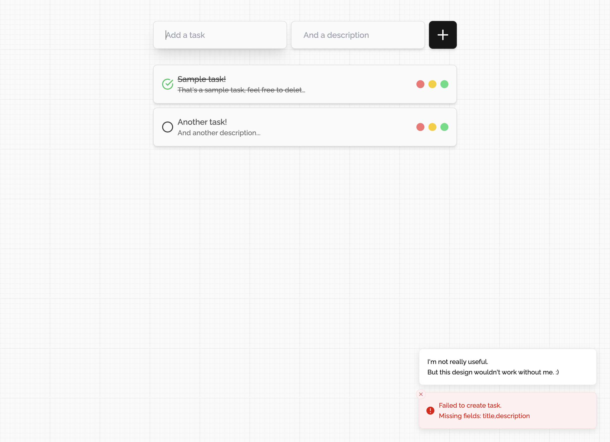

# Integration Engineer Test

We appreciate your interest in the Integration Engineer role at our company. This test helps us understand your skills in creating a Node.js backend API and a ReactJS frontend. You should finish the test within a few hours. Please read the instructions carefully.

## Task Overview

Your task is to build a simple task management application. This template offers a basic setup for a React frontend using Vite, which connects to a Node/Express backend. Users should be able to view, create, update, and delete tasks.

There are different parts to this exercise:

1. Set up the backend and frontend, resolving any issues that may arise (some issues might not have been noticed by the original developer since 'it works locally').
2. Complete the endpoints for task creation and deletion.
3. Implement missing functions in the React frontend to interact with the new endpoints for task creation and deletion.
4. Develop a new endpoint in the Express app for updating tasks. Create a UI allowing users to update tasks and communicate with this new endpoint.
5. Update the CSS to improve the usability of the solution.

### Additional Information

- Tasks should be stored temporarily in memory; permanent storage is not necessary.
- Prevent creating or updating tasks with empty titles or descriptions. Display an error if users attempt to submit an invalid task. (Your backend should handle this check and return an error.)
- No guidance is available from the previous developer on setting up the project on a new machine. You'll need to use the existing files to figure it out, considering possible mistakes.
- The backend is in JavaScript, while the frontend React code is in a .tsx file. Make sure your work is valid TypeScript.
- Enable CORS support in the API to permit cross-origin requests.
- The app's rudimentary styling by the previous developer can be improved for better user experience.
- BONUS: If you can optimize the React app's rendering for efficiency, feel free to make changes.

### Submission Guidelines

- Fork this GitHub repository to your own GitHub account.
- Develop the backend and frontend using the provided directory structure.
- Edit this README below to explain how to run both the backend and frontend.
- Once done, share the link to your forked repository via email.

### Evaluation Criteria

- Functionality: Does the app meet the requirements and work error-free?
- Code Quality: Is the code well-structured, modular, and easy to understand?
- API Design: Did you design the API in a RESTful way? Is error handling and validation effective?
- Frontend Design: Is the frontend user-friendly, responsive, and visually appealing?
- Git Usage: Are your commits meaningful and code changes well-tracked?
- Documentation: Are instructions provided for setting up the app on a new machine?

Use this opportunity to showcase your skills. If you see fit, add extra features or improvements.

Please note that this test aims to be completed in a few hours. However, quality work is more important than speed. If you have questions, feel free to email us.

Best wishes, and we're excited to review your submission!

Regards,
The Duda Solutions Engineering Team

## Add any instructions to get your submission running below this line

# Task management application

## How to Run the Application

To get the TODO Task List up and running, follow these steps:

1. **Clone the Repository:**
   Clone this repository to your local machine using:

   ```bash
   git clone https://github.com/rafaelrcamargo/integration-engineer-take-home
   ```

2. **Navigate to the Root Folder:**
   Open a terminal and `cd` into the root folder of the project:

   ```bash
   cd integration-engineer-take-home
   ```

3. **Set the .env file:**
   This repository comes with a .env.local file that contains the environment variables needed to run the application. If you're running the application locally, you don't need to change anything. However, if you're running it on a server, you'll need to change the `PORT` variable to the port you want the backend to run on.

4. **Run the automated setup script:**
   This project comes with an automated setup script that will install all dependencies and start the backend and frontend servers concurrently. To run it, execute:

   > This expects you to have Node.js and npm installed on your machine. If you don't, you can download them from [here](https://nodejs.org/en/download/)

   ```bash
    npm run start
   ```

   After that you'll have the backend running on [:8000](http://localhost:8000/v1/tasks) and the frontend running on [:5173](http://localhost:5173)

5. **For production:**
   If you want to run the application in production mode, you'll need to follow the build commands for both the backend and the frontend. To do so, run:

   ```bash
    cd backend
    npm run build
    node dist/index.js
   ```

   > This will build your project into the dist/ folder, ready to be hosted

   ```bash
     cd frontend
     npm run build
     npm run serve
   ```

   > This will create a production build of your frontend and Vite will serve it.

## About the API

This API uses Express.js and is completely written in TypeScript. It uses the `cors` middleware to allow cross-origin requests. And it has enabled the `compression` middleware to compress the responses, when working with large amounts of JSON data allowing GZIP compression can be a huge performance boost.

As the base of this API is a Object, this was chosen because the indexed nature of the Object helps with the CRUD operations, as we can access the data by the ID of the task without having to iterate over the whole array thus keeping any operation O(1). And with the convenience of the `Object.values()` method we can easily get an array of all the tasks ordering them by the time they were created if needed.

Other than that this API is behind a versioned API Router, so all routes are prefixed with `/v1`. This allows us to add new versions of the API without interfering with the old ones.

### Endpoints

#### GET /v1/tasks

This endpoint returns an array of all the tasks in the database.

```json
[
  {
    "id": "0b874cab-b136-407d-b8e2-7a2048bbbb23",
    "title": "Sample task!",
    "description": "That's a sample task, feel free to delete it!",
    "timestamp": 1693447122762,
    "completed": false
  }
]
```

#### POST /v1/tasks

This endpoint creates a new task in the database. It expects a JSON body with the following structure:

```json
{
  "title": "Sample task!",
  "description": "That's a sample task, feel free to delete it!"
}
```

#### PUT /v1/tasks/:id

This endpoint updates a task in the database. It expects a JSON body with `0..n` fields of the existing task.

```json
{
  "completed": true
}
```

> This can be used to mark a task as completed.

```json
{
  "title": "New title",
  "description": "New description"
}
```

> This can be used to update the title and description of a task.

#### DELETE /v1/tasks/:id

This endpoint deletes a task from the database.

## About the Frontend

This frontend uses React.js and is also a 100% TypeScript project. It uses Vite as a bundler and development server. This project aims to be a simple but fully fledged frontend for the API while mantaining a good user experience and being visually appealing and responsive.

This application uses `Tailwind` as a CSS framework, this allows for a very fast development process and a responsive design while keeping a consistent look and feel across the application.

For a better user experience, this application uses `Sonner` to display notifications to the user, this allows for a better feedback loop when the user interacts with the application.



> An internal example of the application running with some tasks and notifications.

##
